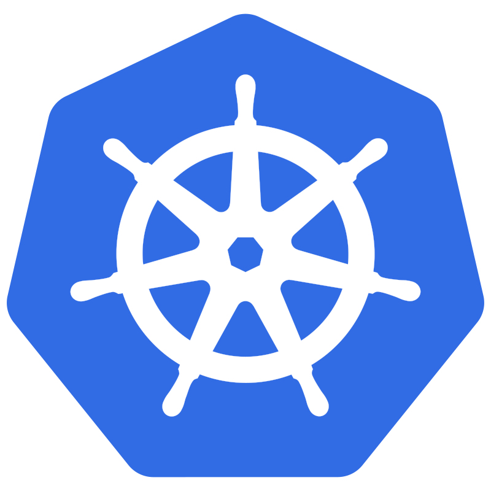

<h2>Certification</h2>

|Issuer|Certificate|
|:---:|:---|
|  | 
 [SysOps Administrator – Associate](https://www.credly.com/badges/45192ab2-dd64-4a12-b5dc-15c456236abf/linked_in?t=s9o3xv) 
|
|  | 
 [Cloud Digital Leader](https://www.credential.net/f5448428-7581-4f14-95c8-27af74519ef0) 
 
 [Associate Cloud Engineer](https://google.accredible.com/0e90b4c6-4806-49a4-9b20-9b0a24eb0288#gs.470z80) 
 |

<h2>Tools Stack</h2>

  &nbsp; &nbsp;  &nbsp; &nbsp  &nbsp; &nbsp;  &nbsp; &nbsp;  

